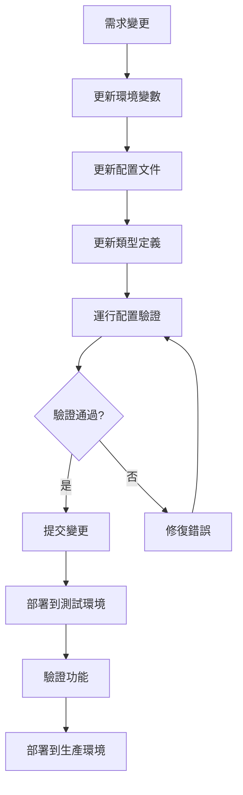

# 配置管理指南

## 📋 概述

本文檔定義了 MKing Friend 項目的配置管理策略，確保所有配置項從代碼中分離，提高系統的可維護性和可擴展性。

## 🎯 核心原則

### 1. 配置分離原則
- **零硬編碼**: 所有配置項必須從代碼中分離
- **環境隔離**: 不同環境使用不同的配置文件
- **類型安全**: 使用 TypeScript 確保配置的類型安全
- **驗證機制**: 所有配置項都必須經過驗證

### 2. 配置層級
```
環境變數 (.env) → 配置文件 (config/) → 預設值 (fallback)
```

## ⚙️ 環境變數管理

### 前端環境變數

**文件位置**: `frontend/.env`

```bash
# ===========================================
# API 服務配置
# ===========================================
VITE_API_BASE_URL=http://localhost:8000
VITE_API_TIMEOUT=30000
VITE_API_RETRY_COUNT=3
VITE_API_VERSION=v1

# ===========================================
# WebSocket 配置
# ===========================================
VITE_SOCKET_URL=ws://localhost:8000
VITE_SOCKET_RECONNECT_INTERVAL=5000
VITE_SOCKET_MAX_RECONNECT_ATTEMPTS=5

# ===========================================
# 應用基本配置
# ===========================================
VITE_APP_NAME="MKing Friend"
VITE_APP_VERSION=1.0.0
VITE_APP_ENVIRONMENT=development
VITE_APP_DEBUG=true

# ===========================================
# 地圖服務配置
# ===========================================
VITE_MAP_DEFAULT_ZOOM=13
VITE_MAP_DEFAULT_LAT=25.0330
VITE_MAP_DEFAULT_LNG=121.5654
VITE_MAP_MIN_ZOOM=3
VITE_MAP_MAX_ZOOM=18
VITE_NOMINATIM_API_URL=https://nominatim.openstreetmap.org
VITE_MAP_TILE_URL=https://{s}.tile.openstreetmap.org/{z}/{x}/{y}.png

# ===========================================
# 多媒體配置
# ===========================================
VITE_MAX_FILE_SIZE=10485760  # 10MB
VITE_MAX_IMAGE_SIZE=5242880  # 5MB
VITE_MAX_VIDEO_SIZE=52428800 # 50MB
VITE_ALLOWED_IMAGE_TYPES=image/jpeg,image/png,image/webp,image/gif
VITE_ALLOWED_VIDEO_TYPES=video/mp4,video/webm,video/ogg
VITE_ALLOWED_AUDIO_TYPES=audio/mp3,audio/wav,audio/ogg

# ===========================================
# 分頁與快取配置
# ===========================================
VITE_DEFAULT_PAGE_SIZE=20
VITE_MAX_PAGE_SIZE=100
VITE_CACHE_DURATION=300000  # 5分鐘
VITE_LOCAL_STORAGE_PREFIX=mking_
VITE_SESSION_STORAGE_PREFIX=mking_session_

# ===========================================
# 通知配置
# ===========================================
VITE_NOTIFICATION_DURATION=5000
VITE_MAX_NOTIFICATIONS=5

# ===========================================
# 安全配置
# ===========================================
VITE_ENABLE_ANALYTICS=false
VITE_ENABLE_ERROR_REPORTING=true
```

### 後端環境變數

**文件位置**: `backend/.env`

```bash
# ===========================================
# 應用配置
# ===========================================
NODE_ENV=development
PORT=8000
APP_NAME="MKing Friend API"
APP_VERSION=1.0.0

# ===========================================
# 資料庫配置
# ===========================================
DATABASE_HOST=localhost
DATABASE_PORT=5432
DATABASE_NAME=mking_friend
DATABASE_USER=postgres
DATABASE_PASSWORD=password
DATABASE_SSL=false
DATABASE_POOL_MIN=2
DATABASE_POOL_MAX=10
DATABASE_TIMEOUT=30000

# ===========================================
# Redis 配置
# ===========================================
REDIS_HOST=localhost
REDIS_PORT=6379
REDIS_PASSWORD=
REDIS_DB=0
REDIS_TTL=3600

# ===========================================
# JWT 配置
# ===========================================
JWT_SECRET=your-super-secret-key-change-in-production
JWT_EXPIRES_IN=7d
JWT_REFRESH_EXPIRES_IN=30d
JWT_ISSUER=mking-friend

# ===========================================
# 郵件服務配置
# ===========================================
SMTP_HOST=smtp.gmail.com
SMTP_PORT=587
SMTP_SECURE=false
SMTP_USER=your-email@gmail.com
SMTP_PASS=your-app-password
SMTP_FROM_NAME="MKing Friend"
SMTP_FROM_EMAIL=noreply@mkingfriend.com

# ===========================================
# 檔案上傳配置
# ===========================================
UPLOAD_MAX_SIZE=10485760
UPLOAD_ALLOWED_TYPES=image/jpeg,image/png,video/mp4
UPLOAD_STORAGE_PATH=./uploads
UPLOAD_TEMP_PATH=./temp
UPLOAD_PUBLIC_URL=http://localhost:8000/uploads

# ===========================================
# 安全配置
# ===========================================
CORS_ORIGIN=http://localhost:3000
RATE_LIMIT_WINDOW=900000  # 15分鐘
RATE_LIMIT_MAX_REQUESTS=100
BCRYPT_ROUNDS=12

# ===========================================
# 日誌配置
# ===========================================
LOG_LEVEL=debug
LOG_FILE_PATH=./logs
LOG_MAX_SIZE=10m
LOG_MAX_FILES=5

# ===========================================
# 監控配置
# ===========================================
SENTRY_DSN=
SENTRY_ENVIRONMENT=development
```

## 📁 配置文件結構

### 前端配置文件組織

```
src/config/
├── index.ts          # 配置入口文件
├── constants.ts      # 應用常數配置
├── api.ts           # API 相關配置
├── i18n.ts          # 多國語言配置
├── categories.ts    # 固定分類配置
├── routes.ts        # 路由配置
├── theme.ts         # 主題配置
├── upload.ts        # 上傳配置
├── map.ts           # 地圖配置
├── validation.ts    # 驗證規則
└── validator.ts     # 配置驗證器
```

### 1. 配置入口文件

**文件**: `src/config/index.ts`

```typescript
// 統一導出所有配置
export * from './constants';
export * from './api';
export * from './i18n';
export * from './categories';
export * from './routes';
export * from './theme';
export * from './upload';
export * from './map';
export * from './validation';

// 配置驗證
import { validateConfig } from './validator';

// 在應用啟動時驗證配置
validateConfig();
```

### 2. 應用常數配置

**文件**: `src/config/constants.ts`

```typescript
// 應用基本配置
export const APP_CONFIG = {
  NAME: import.meta.env.VITE_APP_NAME || 'MKing Friend',
  VERSION: import.meta.env.VITE_APP_VERSION || '1.0.0',
  ENVIRONMENT: import.meta.env.VITE_APP_ENVIRONMENT || 'development',
  DEBUG: import.meta.env.VITE_APP_DEBUG === 'true',
} as const;

// 分頁配置
export const PAGINATION_CONFIG = {
  DEFAULT_PAGE_SIZE: Number(import.meta.env.VITE_DEFAULT_PAGE_SIZE) || 20,
  MAX_PAGE_SIZE: Number(import.meta.env.VITE_MAX_PAGE_SIZE) || 100,
  PAGE_SIZE_OPTIONS: [10, 20, 50, 100],
} as const;

// 快取配置
export const CACHE_CONFIG = {
  DURATION: Number(import.meta.env.VITE_CACHE_DURATION) || 300000, // 5分鐘
  LOCAL_STORAGE_PREFIX: import.meta.env.VITE_LOCAL_STORAGE_PREFIX || 'mking_',
  SESSION_STORAGE_PREFIX: import.meta.env.VITE_SESSION_STORAGE_PREFIX || 'mking_session_',
} as const;

// 通知配置
export const NOTIFICATION_CONFIG = {
  DURATION: Number(import.meta.env.VITE_NOTIFICATION_DURATION) || 5000,
  MAX_COUNT: Number(import.meta.env.VITE_MAX_NOTIFICATIONS) || 5,
  POSITION: 'topRight' as const,
} as const;

// 安全配置
export const SECURITY_CONFIG = {
  ENABLE_ANALYTICS: import.meta.env.VITE_ENABLE_ANALYTICS === 'true',
  ENABLE_ERROR_REPORTING: import.meta.env.VITE_ENABLE_ERROR_REPORTING === 'true',
} as const;
```

### 3. API 配置

**文件**: `src/config/api.ts`

```typescript
// API 基本配置
export const API_CONFIG = {
  BASE_URL: import.meta.env.VITE_API_BASE_URL || 'http://localhost:8000',
  VERSION: import.meta.env.VITE_API_VERSION || 'v1',
  TIMEOUT: Number(import.meta.env.VITE_API_TIMEOUT) || 30000,
  RETRY_COUNT: Number(import.meta.env.VITE_API_RETRY_COUNT) || 3,
  RETRY_DELAY: 1000, // 1秒
} as const;

// WebSocket 配置
export const SOCKET_CONFIG = {
  URL: import.meta.env.VITE_SOCKET_URL || 'ws://localhost:8000',
  RECONNECT_INTERVAL: Number(import.meta.env.VITE_SOCKET_RECONNECT_INTERVAL) || 5000,
  MAX_RECONNECT_ATTEMPTS: Number(import.meta.env.VITE_SOCKET_MAX_RECONNECT_ATTEMPTS) || 5,
  HEARTBEAT_INTERVAL: 30000, // 30秒
} as const;

// API 端點配置
export const API_ENDPOINTS = {
  AUTH: {
    LOGIN: '/auth/login',
    REGISTER: '/auth/register',
    LOGOUT: '/auth/logout',
    REFRESH: '/auth/refresh',
    VERIFY_EMAIL: '/auth/verify-email',
    FORGOT_PASSWORD: '/auth/forgot-password',
    RESET_PASSWORD: '/auth/reset-password',
  },
  USER: {
    PROFILE: '/user/profile',
    UPDATE_PROFILE: '/user/profile',
    UPLOAD_AVATAR: '/user/avatar',
    DISCOVER: '/user/discover',
    LIKE: '/user/like',
    PASS: '/user/pass',
    BLOCK: '/user/block',
  },
  CHAT: {
    ROOMS: '/chat/rooms',
    MESSAGES: '/chat/messages',
    SEND: '/chat/send',
    UPLOAD: '/chat/upload',
    TYPING: '/chat/typing',
  },
  NOTIFICATION: {
    LIST: '/notifications',
    MARK_READ: '/notifications/read',
    SETTINGS: '/notifications/settings',
  },
} as const;
```

### 4. 上傳配置

**文件**: `src/config/upload.ts`

```typescript
// 檔案上傳配置
export const UPLOAD_CONFIG = {
  MAX_FILE_SIZE: Number(import.meta.env.VITE_MAX_FILE_SIZE) || 10485760, // 10MB
  MAX_IMAGE_SIZE: Number(import.meta.env.VITE_MAX_IMAGE_SIZE) || 5242880, // 5MB
  MAX_VIDEO_SIZE: Number(import.meta.env.VITE_MAX_VIDEO_SIZE) || 52428800, // 50MB
  
  ALLOWED_IMAGE_TYPES: import.meta.env.VITE_ALLOWED_IMAGE_TYPES?.split(',') || [
    'image/jpeg',
    'image/png',
    'image/webp',
    'image/gif'
  ],
  
  ALLOWED_VIDEO_TYPES: import.meta.env.VITE_ALLOWED_VIDEO_TYPES?.split(',') || [
    'video/mp4',
    'video/webm',
    'video/ogg'
  ],
  
  ALLOWED_AUDIO_TYPES: import.meta.env.VITE_ALLOWED_AUDIO_TYPES?.split(',') || [
    'audio/mp3',
    'audio/wav',
    'audio/ogg'
  ],
  
  // 圖片壓縮配置
  IMAGE_QUALITY: 0.8,
  IMAGE_MAX_WIDTH: 1920,
  IMAGE_MAX_HEIGHT: 1080,
  
  // 頭像配置
  AVATAR_SIZE: 200,
  AVATAR_QUALITY: 0.9,
} as const;

// 檔案類型檢查函數
export const isValidImageType = (type: string): boolean => {
  return UPLOAD_CONFIG.ALLOWED_IMAGE_TYPES.includes(type);
};

export const isValidVideoType = (type: string): boolean => {
  return UPLOAD_CONFIG.ALLOWED_VIDEO_TYPES.includes(type);
};

export const isValidAudioType = (type: string): boolean => {
  return UPLOAD_CONFIG.ALLOWED_AUDIO_TYPES.includes(type);
};

// 檔案大小檢查函數
export const isValidFileSize = (size: number, type: string): boolean => {
  if (isValidImageType(type)) {
    return size <= UPLOAD_CONFIG.MAX_IMAGE_SIZE;
  }
  if (isValidVideoType(type)) {
    return size <= UPLOAD_CONFIG.MAX_VIDEO_SIZE;
  }
  return size <= UPLOAD_CONFIG.MAX_FILE_SIZE;
};
```

### 5. 地圖配置

**文件**: `src/config/map.ts`

```typescript
// 地圖服務配置
export const MAP_CONFIG = {
  DEFAULT_ZOOM: Number(import.meta.env.VITE_MAP_DEFAULT_ZOOM) || 13,
  MIN_ZOOM: Number(import.meta.env.VITE_MAP_MIN_ZOOM) || 3,
  MAX_ZOOM: Number(import.meta.env.VITE_MAP_MAX_ZOOM) || 18,
  
  DEFAULT_POSITION: {
    lat: Number(import.meta.env.VITE_MAP_DEFAULT_LAT) || 25.0330,
    lng: Number(import.meta.env.VITE_MAP_DEFAULT_LNG) || 121.5654,
  },
  
  // 地圖圖層配置
  TILE_LAYER: {
    URL: import.meta.env.VITE_MAP_TILE_URL || 'https://{s}.tile.openstreetmap.org/{z}/{x}/{y}.png',
    ATTRIBUTION: '© OpenStreetMap contributors',
    MAX_ZOOM: 19,
  },
  
  // 地理編碼服務
  NOMINATIM: {
    API_URL: import.meta.env.VITE_NOMINATIM_API_URL || 'https://nominatim.openstreetmap.org',
    SEARCH_LIMIT: 5,
    LANGUAGE: 'zh-TW',
  },
  
  // 地圖控制項
  CONTROLS: {
    ZOOM: true,
    ATTRIBUTION: true,
    SCALE: true,
    FULLSCREEN: true,
  },
  
  // 標記配置
  MARKER: {
    DEFAULT_ICON_SIZE: [25, 41],
    CLUSTER_MAX_ZOOM: 15,
    CLUSTER_RADIUS: 80,
  },
} as const;

// 地圖樣式主題
export const MAP_THEMES = {
  DEFAULT: {
    name: '預設',
    url: 'https://{s}.tile.openstreetmap.org/{z}/{x}/{y}.png',
  },
  DARK: {
    name: '深色',
    url: 'https://{s}.basemaps.cartocdn.com/dark_all/{z}/{x}/{y}{r}.png',
  },
  LIGHT: {
    name: '淺色',
    url: 'https://{s}.basemaps.cartocdn.com/light_all/{z}/{x}/{y}{r}.png',
  },
} as const;
```

### 6. 配置驗證器

**文件**: `src/config/validator.ts`

```typescript
import { z } from 'zod';

// 環境變數驗證 Schema
const envSchema = z.object({
  // API 配置驗證
  VITE_API_BASE_URL: z.string().url('API Base URL 必須是有效的 URL'),
  VITE_API_TIMEOUT: z.string().transform(Number).pipe(
    z.number().positive('API Timeout 必須是正數')
  ),
  VITE_API_RETRY_COUNT: z.string().transform(Number).pipe(
    z.number().min(0).max(10, 'API 重試次數不能超過 10 次')
  ),
  
  // WebSocket 配置驗證
  VITE_SOCKET_URL: z.string().refine(
    (url) => url.startsWith('ws://') || url.startsWith('wss://'),
    'WebSocket URL 必須以 ws:// 或 wss:// 開頭'
  ),
  
  // 檔案大小驗證
  VITE_MAX_FILE_SIZE: z.string().transform(Number).pipe(
    z.number().positive('檔案大小限制必須是正數')
  ),
  
  // 地圖配置驗證
  VITE_MAP_DEFAULT_LAT: z.string().transform(Number).pipe(
    z.number().min(-90).max(90, '緯度必須在 -90 到 90 之間')
  ),
  VITE_MAP_DEFAULT_LNG: z.string().transform(Number).pipe(
    z.number().min(-180).max(180, '經度必須在 -180 到 180 之間')
  ),
  
  // 可選配置
  VITE_APP_NAME: z.string().optional(),
  VITE_APP_VERSION: z.string().optional(),
  VITE_APP_ENVIRONMENT: z.enum(['development', 'staging', 'production']).optional(),
});

// 配置驗證函數
export const validateConfig = (): void => {
  try {
    envSchema.parse(import.meta.env);
    console.log('✅ 環境變數配置驗證通過');
  } catch (error) {
    if (error instanceof z.ZodError) {
      console.error('❌ 環境變數配置驗證失敗:');
      error.errors.forEach((err) => {
        console.error(`  - ${err.path.join('.')}: ${err.message}`);
      });
    }
    throw new Error('環境變數配置不正確，請檢查 .env 文件');
  }
};

// 運行時配置檢查
export const checkRuntimeConfig = (): boolean => {
  const checks = [
    {
      name: 'API 連接',
      test: () => fetch(`${import.meta.env.VITE_API_BASE_URL}/health`).then(r => r.ok),
    },
    {
      name: 'WebSocket 連接',
      test: () => {
        return new Promise((resolve) => {
          const ws = new WebSocket(import.meta.env.VITE_SOCKET_URL);
          ws.onopen = () => {
            ws.close();
            resolve(true);
          };
          ws.onerror = () => resolve(false);
          setTimeout(() => resolve(false), 5000);
        });
      },
    },
  ];
  
  // 在開發環境中執行檢查
  if (import.meta.env.DEV) {
    checks.forEach(async (check) => {
      try {
        const result = await check.test();
        console.log(`${result ? '✅' : '❌'} ${check.name}`);
      } catch (error) {
        console.error(`❌ ${check.name}: ${error}`);
      }
    });
  }
  
  return true;
};
```

## 🌐 多國語言配置

### 語言配置文件

**文件**: `src/config/i18n.ts`

```typescript
// 多國語言配置
export const I18N_CONFIG = {
  DEFAULT_LANGUAGE: 'zh-TW',
  SUPPORTED_LANGUAGES: ['zh-TW', 'en-US'],
  FALLBACK_LANGUAGE: 'zh-TW',
  
  DETECTION_OPTIONS: {
    order: ['localStorage', 'navigator', 'htmlTag'],
    caches: ['localStorage'],
    lookupLocalStorage: 'i18nextLng',
  },
  
  INTERPOLATION: {
    escapeValue: false, // React 已經處理 XSS
  },
  
  LOAD_PATH: '/locales/{{lng}}/{{ns}}.json',
  
  // 命名空間配置
  NAMESPACES: {
    COMMON: 'common',
    AUTH: 'auth',
    CHAT: 'chat',
    PROFILE: 'profile',
    SETTINGS: 'settings',
    ERRORS: 'errors',
  },
  
  DEFAULT_NAMESPACE: 'common',
} as const;

// 語言資源動態載入配置
export const LANGUAGE_RESOURCES = {
  'zh-TW': {
    common: () => import('../i18n/zh-TW/common.json'),
    auth: () => import('../i18n/zh-TW/auth.json'),
    chat: () => import('../i18n/zh-TW/chat.json'),
    profile: () => import('../i18n/zh-TW/profile.json'),
    settings: () => import('../i18n/zh-TW/settings.json'),
    errors: () => import('../i18n/zh-TW/errors.json'),
  },
  'en-US': {
    common: () => import('../i18n/en-US/common.json'),
    auth: () => import('../i18n/en-US/auth.json'),
    chat: () => import('../i18n/en-US/chat.json'),
    profile: () => import('../i18n/en-US/profile.json'),
    settings: () => import('../i18n/en-US/settings.json'),
    errors: () => import('../i18n/en-US/errors.json'),
  },
} as const;

// 語言選項
export const LANGUAGE_OPTIONS = [
  { value: 'zh-TW', label: '繁體中文', flag: '🇹🇼' },
  { value: 'en-US', label: 'English', flag: '🇺🇸' },
] as const;
```

### 語言資源文件結構

```
src/i18n/
├── zh-TW/
│   ├── common.json       # 通用文字
│   ├── auth.json         # 認證相關
│   ├── chat.json         # 聊天功能
│   ├── profile.json      # 個人資料
│   ├── settings.json     # 設定頁面
│   └── errors.json       # 錯誤訊息
└── en-US/
    ├── common.json
    ├── auth.json
    ├── chat.json
    ├── profile.json
    ├── settings.json
    └── errors.json
```

## 🗂️ 固定分類配置

**文件**: `src/config/categories.ts`

```typescript
// 用戶相關分類
export const USER_CATEGORIES = {
  // 年齡範圍
  AGE_RANGES: [
    { value: '18-25', label: '18-25歲', min: 18, max: 25 },
    { value: '26-30', label: '26-30歲', min: 26, max: 30 },
    { value: '31-35', label: '31-35歲', min: 31, max: 35 },
    { value: '36-40', label: '36-40歲', min: 36, max: 40 },
    { value: '41-50', label: '41-50歲', min: 41, max: 50 },
    { value: '51+', label: '51歲以上', min: 51, max: 100 },
  ],
  
  // 興趣愛好
  INTERESTS: [
    { id: 'music', label: '音樂', icon: 'music', category: 'entertainment' },
    { id: 'sports', label: '運動', icon: 'activity', category: 'health' },
    { id: 'travel', label: '旅行', icon: 'map-pin', category: 'lifestyle' },
    { id: 'reading', label: '閱讀', icon: 'book', category: 'education' },
    { id: 'cooking', label: '烹飪', icon: 'chef-hat', category: 'lifestyle' },
    { id: 'gaming', label: '遊戲', icon: 'gamepad-2', category: 'entertainment' },
    { id: 'photography', label: '攝影', icon: 'camera', category: 'art' },
    { id: 'art', label: '藝術', icon: 'palette', category: 'art' },
    { id: 'movies', label: '電影', icon: 'film', category: 'entertainment' },
    { id: 'fitness', label: '健身', icon: 'dumbbell', category: 'health' },
  ],
  
  // 教育程度
  EDUCATION_LEVELS: [
    { value: 'high_school', label: '高中', order: 1 },
    { value: 'college', label: '大學', order: 2 },
    { value: 'bachelor', label: '學士', order: 3 },
    { value: 'master', label: '碩士', order: 4 },
    { value: 'phd', label: '博士', order: 5 },
  ],
  
  // 交友目標
  RELATIONSHIP_GOALS: [
    { value: 'friendship', label: '純友誼', description: '尋找志同道合的朋友' },
    { value: 'casual', label: '輕鬆交友', description: '輕鬆愉快的交友體驗' },
    { value: 'dating', label: '約會交往', description: '尋找約會對象' },
    { value: 'serious', label: '認真交往', description: '尋找長期穩定關係' },
    { value: 'marriage', label: '尋找結婚對象', description: '以結婚為目標' },
  ],
  
  // 職業分類
  OCCUPATIONS: [
    { category: 'tech', label: '科技業', jobs: ['軟體工程師', '產品經理', '設計師'] },
    { category: 'finance', label: '金融業', jobs: ['銀行員', '會計師', '投資顧問'] },
    { category: 'education', label: '教育業', jobs: ['教師', '教授', '研究員'] },
    { category: 'healthcare', label: '醫療業', jobs: ['醫師', '護理師', '藥師'] },
    { category: 'service', label: '服務業', jobs: ['餐飲', '零售', '旅遊'] },
    { category: 'creative', label: '創意產業', jobs: ['藝術家', '作家', '音樂家'] },
    { category: 'other', label: '其他', jobs: ['自由業', '學生', '其他'] },
  ],
} as const;

// 聊天相關分類
export const CHAT_CATEGORIES = {
  // 訊息類型
  MESSAGE_TYPES: [
    { value: 'text', label: '文字訊息', icon: 'message-circle' },
    { value: 'image', label: '圖片訊息', icon: 'image' },
    { value: 'video', label: '影片訊息', icon: 'video' },
    { value: 'audio', label: '語音訊息', icon: 'mic' },
    { value: 'file', label: '檔案訊息', icon: 'file' },
    { value: 'location', label: '位置訊息', icon: 'map-pin' },
  ],
  
  // 表情符號分類
  EMOJI_CATEGORIES: [
    { id: 'smileys', label: '表情', icon: '😀', keywords: ['smile', 'happy', 'sad'] },
    { id: 'people', label: '人物', icon: '👋', keywords: ['people', 'body', 'hand'] },
    { id: 'nature', label: '自然', icon: '🌱', keywords: ['nature', 'plant', 'animal'] },
    { id: 'food', label: '食物', icon: '🍎', keywords: ['food', 'drink', 'fruit'] },
    { id: 'activities', label: '活動', icon: '⚽', keywords: ['sport', 'game', 'activity'] },
    { id: 'travel', label: '旅行', icon: '🚗', keywords: ['travel', 'place', 'transport'] },
    { id: 'objects', label: '物品', icon: '💡', keywords: ['object', 'tool', 'symbol'] },
    { id: 'symbols', label: '符號', icon: '❤️', keywords: ['symbol', 'heart', 'flag'] },
  ],
  
  // 聊天室狀態
  ROOM_STATUS: [
    { value: 'active', label: '活躍', color: 'green' },
    { value: 'inactive', label: '非活躍', color: 'gray' },
    { value: 'archived', label: '已封存', color: 'orange' },
    { value: 'blocked', label: '已封鎖', color: 'red' },
  ],
} as const;

// 系統設定分類
export const SYSTEM_CATEGORIES = {
  // 通知類型
  NOTIFICATION_TYPES: [
    { type: 'match', label: '配對通知', description: '有新的配對時通知', default: true },
    { type: 'message', label: '訊息通知', description: '收到新訊息時通知', default: true },
    { type: 'like', label: '喜歡通知', description: '有人喜歡你時通知', default: true },
    { type: 'visit', label: '訪客通知', description: '有人查看你的資料時通知', default: false },
    { type: 'system', label: '系統通知', description: '系統重要訊息通知', default: true },
  ],
  
  // 隱私設定
  PRIVACY_SETTINGS: [
    { key: 'show_online_status', label: '顯示在線狀態', default: true },
    { key: 'show_last_seen', label: '顯示最後上線時間', default: true },
    { key: 'allow_search', label: '允許被搜尋', default: true },
    { key: 'show_distance', label: '顯示距離', default: true },
    { key: 'auto_location', label: '自動更新位置', default: false },
  ],
  
  // 主題選項
  THEME_OPTIONS: [
    { value: 'light', label: '淺色主題', icon: 'sun' },
    { value: 'dark', label: '深色主題', icon: 'moon' },
    { value: 'auto', label: '跟隨系統', icon: 'monitor' },
  ],
} as const;

// 輔助函數
export const getCategoryById = (categories: any[], id: string) => {
  return categories.find(item => item.id === id || item.value === id);
};

export const getCategoriesByType = (type: string) => {
  switch (type) {
    case 'interests':
      return USER_CATEGORIES.INTERESTS;
    case 'education':
      return USER_CATEGORIES.EDUCATION_LEVELS;
    case 'goals':
      return USER_CATEGORIES.RELATIONSHIP_GOALS;
    default:
      return [];
  }
};
```

## 🛣️ 路由配置

**文件**: `src/config/routes.ts`

```typescript
// 路由配置
export const ROUTES = {
  // 公開路由 (不需要認證)
  PUBLIC: {
    HOME: '/',
    LOGIN: '/login',
    REGISTER: '/register',
    FORGOT_PASSWORD: '/forgot-password',
    RESET_PASSWORD: '/reset-password/:token',
    VERIFY_EMAIL: '/verify-email/:token',
    PRIVACY: '/privacy',
    TERMS: '/terms',
    ABOUT: '/about',
    CONTACT: '/contact',
  },
  
  // 需要認證的路由
  PROTECTED: {
    DASHBOARD: '/dashboard',
    PROFILE: '/profile',
    EDIT_PROFILE: '/profile/edit',
    PROFILE_PHOTOS: '/profile/photos',
    DISCOVER: '/discover',
    MATCHES: '/matches',
    LIKES: '/likes',
    CHAT: '/chat',
    CHAT_ROOM: '/chat/:roomId',
    SETTINGS: '/settings',
    SETTINGS_ACCOUNT: '/settings/account',
    SETTINGS_PRIVACY: '/settings/privacy',
    SETTINGS_NOTIFICATIONS: '/settings/notifications',
    NOTIFICATIONS: '/notifications',
    HELP: '/help',
  },
  
  // 管理員路由
  ADMIN: {
    DASHBOARD: '/admin',
    USERS: '/admin/users',
    REPORTS: '/admin/reports',
    ANALYTICS: '/admin/analytics',
    SETTINGS: '/admin/settings',
  },
} as const;

// API 路由配置
export const API_ROUTES = {
  // 認證相關
  AUTH: {
    LOGIN: '/api/auth/login',
    REGISTER: '/api/auth/register',
    LOGOUT: '/api/auth/logout',
    REFRESH: '/api/auth/refresh',
    VERIFY_EMAIL: '/api/auth/verify-email',
    FORGOT_PASSWORD: '/api/auth/forgot-password',
    RESET_PASSWORD: '/api/auth/reset-password',
    CHECK_EMAIL: '/api/auth/check-email',
  },
  
  // 用戶相關
  USER: {
    PROFILE: '/api/user/profile',
    UPDATE_PROFILE: '/api/user/profile',
    UPLOAD_AVATAR: '/api/user/avatar',
    UPLOAD_PHOTOS: '/api/user/photos',
    DELETE_PHOTO: '/api/user/photos/:photoId',
    DISCOVER: '/api/user/discover',
    LIKE: '/api/user/like',
    PASS: '/api/user/pass',
    BLOCK: '/api/user/block',
    REPORT: '/api/user/report',
    SEARCH: '/api/user/search',
  },
  
  // 聊天相關
  CHAT: {
    ROOMS: '/api/chat/rooms',
    ROOM_DETAIL: '/api/chat/rooms/:roomId',
    MESSAGES: '/api/chat/rooms/:roomId/messages',
    SEND_MESSAGE: '/api/chat/rooms/:roomId/messages',
    UPLOAD_FILE: '/api/chat/upload',
    TYPING: '/api/chat/rooms/:roomId/typing',
    READ_MESSAGES: '/api/chat/rooms/:roomId/read',
  },
  
  // 通知相關
  NOTIFICATION: {
    LIST: '/api/notifications',
    MARK_READ: '/api/notifications/:id/read',
    MARK_ALL_READ: '/api/notifications/read-all',
    SETTINGS: '/api/notifications/settings',
    DELETE: '/api/notifications/:id',
  },
  
  // 系統相關
  SYSTEM: {
    HEALTH: '/api/health',
    CONFIG: '/api/config',
    UPLOAD: '/api/upload',
    GEOCODE: '/api/geocode',
  },
} as const;

// 路由輔助函數
export const buildRoute = (route: string, params: Record<string, string | number>): string => {
  return Object.entries(params).reduce(
    (path, [key, value]) => path.replace(`:${key}`, String(value)),
    route
  );
};

// 路由權限檢查
export const getRoutePermission = (path: string): 'public' | 'protected' | 'admin' => {
  if (Object.values(ROUTES.PUBLIC).includes(path)) {
    return 'public';
  }
  if (Object.values(ROUTES.ADMIN).some(route => path.startsWith(route.split(':')[0]))) {
    return 'admin';
  }
  return 'protected';
};

// 路由導航配置
export const NAVIGATION_ROUTES = [
  { path: ROUTES.PROTECTED.DISCOVER, label: '探索', icon: 'compass' },
  { path: ROUTES.PROTECTED.MATCHES, label: '配對', icon: 'heart' },
  { path: ROUTES.PROTECTED.CHAT, label: '聊天', icon: 'message-circle' },
  { path: ROUTES.PROTECTED.PROFILE, label: '個人', icon: 'user' },
] as const;

// 使用範例:
// buildRoute(ROUTES.PROTECTED.CHAT_ROOM, { roomId: '123' }) => '/chat/123'
// buildRoute(API_ROUTES.CHAT.MESSAGES, { roomId: '123' }) => '/api/chat/rooms/123/messages'
```

## 🎨 主題配置

**文件**: `src/config/theme.ts`

```typescript
import type { ThemeConfig } from 'antd';

// 基礎主題配置
export const BASE_THEME_CONFIG: ThemeConfig = {
  token: {
    // 主色彩
    colorPrimary: '#1890ff',
    colorSuccess: '#52c41a',
    colorWarning: '#faad14',
    colorError: '#ff4d4f',
    colorInfo: '#1890ff',
    
    // 字體配置
    fontFamily: '-apple-system, BlinkMacSystemFont, "Segoe UI", Roboto, "Helvetica Neue", Arial, "Noto Sans TC", sans-serif',
    fontSize: 14,
    fontSizeHeading1: 38,
    fontSizeHeading2: 30,
    fontSizeHeading3: 24,
    fontSizeHeading4: 20,
    fontSizeHeading5: 16,
    
    // 間距配置
    padding: 16,
    margin: 16,
    paddingXS: 8,
    paddingSM: 12,
    paddingLG: 24,
    paddingXL: 32,
    
    // 圓角配置
    borderRadius: 6,
    borderRadiusLG: 8,
    borderRadiusSM: 4,
    
    // 陰影配置
    boxShadow: '0 2px 8px rgba(0, 0, 0, 0.15)',
    boxShadowSecondary: '0 4px 12px rgba(0, 0, 0, 0.15)',
    
    // 動畫配置
    motionDurationFast: '0.1s',
    motionDurationMid: '0.2s',
    motionDurationSlow: '0.3s',
  },
  
  components: {
    Button: {
      borderRadius: 8,
      controlHeight: 40,
      fontWeight: 500,
    },
    Input: {
      borderRadius: 8,
      controlHeight: 40,
    },
    Card: {
      borderRadius: 12,
      paddingLG: 24,
    },
    Modal: {
      borderRadius: 12,
    },
    Drawer: {
      borderRadius: 12,
    },
    Message: {
      borderRadius: 8,
    },
    Notification: {
      borderRadius: 8,
    },
  },
};

// 淺色主題配置
export const LIGHT_THEME_CONFIG: ThemeConfig = {
  ...BASE_THEME_CONFIG,
  token: {
    ...BASE_THEME_CONFIG.token,
    colorBgBase: '#ffffff',
    colorTextBase: '#000000',
    colorBgContainer: '#ffffff',
    colorBgElevated: '#ffffff',
    colorBorder: '#d9d9d9',
    colorBorderSecondary: '#f0f0f0',
  },
};

// 深色主題配置
export const DARK_THEME_CONFIG: ThemeConfig = {
  ...BASE_THEME_CONFIG,
  algorithm: 'dark',
  token: {
    ...BASE_THEME_CONFIG.token,
    colorBgBase: '#141414',
    colorTextBase: '#ffffff',
    colorBgContainer: '#1f1f1f',
    colorBgElevated: '#262626',
    colorBorder: '#434343',
    colorBorderSecondary: '#303030',
  },
};

// 響應式斷點
export const BREAKPOINTS = {
  xs: 480,
  sm: 576,
  md: 768,
  lg: 992,
  xl: 1200,
  xxl: 1600,
} as const;

// Z-index 層級管理
export const Z_INDEX = {
  BASE: 1,
  DROPDOWN: 1000,
  STICKY: 1020,
  FIXED: 1030,
  MODAL_BACKDROP: 1040,
  MODAL: 1050,
  POPOVER: 1060,
  TOOLTIP: 1070,
  NOTIFICATION: 1080,
  LOADING: 1090,
} as const;

// 顏色調色板
export const COLOR_PALETTE = {
  // 主要顏色
  PRIMARY: {
    50: '#e6f7ff',
    100: '#bae7ff',
    200: '#91d5ff',
    300: '#69c0ff',
    400: '#40a9ff',
    500: '#1890ff', // 主色
    600: '#096dd9',
    700: '#0050b3',
    800: '#003a8c',
    900: '#002766',
  },
  
  // 成功顏色
  SUCCESS: {
    50: '#f6ffed',
    100: '#d9f7be',
    200: '#b7eb8f',
    300: '#95de64',
    400: '#73d13d',
    500: '#52c41a', // 主色
    600: '#389e0d',
    700: '#237804',
    800: '#135200',
    900: '#092b00',
  },
  
  // 警告顏色
  WARNING: {
    50: '#fffbe6',
    100: '#fff1b8',
    200: '#ffe58f',
    300: '#ffd666',
    400: '#ffc53d',
    500: '#faad14', // 主色
    600: '#d48806',
    700: '#ad6800',
    800: '#874d00',
    900: '#613400',
  },
  
  // 錯誤顏色
  ERROR: {
    50: '#fff2f0',
    100: '#ffccc7',
    200: '#ffa39e',
    300: '#ff7875',
    400: '#ff4d4f', // 主色
    500: '#f5222d',
    600: '#cf1322',
    700: '#a8071a',
    800: '#820014',
    900: '#5c0011',
  },
  
  // 中性顏色
  NEUTRAL: {
    50: '#fafafa',
    100: '#f5f5f5',
    200: '#f0f0f0',
    300: '#d9d9d9',
    400: '#bfbfbf',
    500: '#8c8c8c',
    600: '#595959',
    700: '#434343',
    800: '#262626',
    900: '#1f1f1f',
  },
} as const;

// 動畫配置
export const ANIMATION_CONFIG = {
  // 緩動函數
  EASING: {
    EASE_IN: 'cubic-bezier(0.4, 0, 1, 1)',
    EASE_OUT: 'cubic-bezier(0, 0, 0.2, 1)',
    EASE_IN_OUT: 'cubic-bezier(0.4, 0, 0.2, 1)',
    BOUNCE: 'cubic-bezier(0.68, -0.55, 0.265, 1.55)',
  },
  
  // 持續時間
  DURATION: {
    FAST: 150,
    NORMAL: 300,
    SLOW: 500,
  },
  
  // 常用動畫
  TRANSITIONS: {
    FADE: 'opacity 0.3s ease-in-out',
    SLIDE: 'transform 0.3s ease-in-out',
    SCALE: 'transform 0.2s ease-in-out',
  },
} as const;

// 主題工具函數
export const getThemeConfig = (theme: 'light' | 'dark' | 'auto'): ThemeConfig => {
  if (theme === 'auto') {
    // 檢測系統主題
    const prefersDark = window.matchMedia('(prefers-color-scheme: dark)').matches;
    return prefersDark ? DARK_THEME_CONFIG : LIGHT_THEME_CONFIG;
  }
  
  return theme === 'dark' ? DARK_THEME_CONFIG : LIGHT_THEME_CONFIG;
};

// 響應式工具函數
export const getBreakpoint = (): keyof typeof BREAKPOINTS => {
  const width = window.innerWidth;
  
  if (width >= BREAKPOINTS.xxl) return 'xxl';
  if (width >= BREAKPOINTS.xl) return 'xl';
  if (width >= BREAKPOINTS.lg) return 'lg';
  if (width >= BREAKPOINTS.md) return 'md';
  if (width >= BREAKPOINTS.sm) return 'sm';
  return 'xs';
};

// CSS 變數生成
export const generateCSSVariables = (theme: 'light' | 'dark') => {
  const config = theme === 'dark' ? DARK_THEME_CONFIG : LIGHT_THEME_CONFIG;
  const { token } = config;
  
  return {
    '--color-primary': token?.colorPrimary,
    '--color-success': token?.colorSuccess,
    '--color-warning': token?.colorWarning,
    '--color-error': token?.colorError,
    '--color-bg-base': token?.colorBgBase,
    '--color-text-base': token?.colorTextBase,
    '--border-radius': `${token?.borderRadius}px`,
    '--font-family': token?.fontFamily,
    '--font-size': `${token?.fontSize}px`,
  };
};
```

## 🔧 配置管理最佳實踐

### 1. 開發階段檢查清單

- [ ] **環境變數檢查**
  - [ ] 所有 URL、端口號都使用環境變數
  - [ ] 敏感信息不出現在前端環境變數中
  - [ ] 環境變數都有合理的預設值
  - [ ] 使用 Zod 驗證所有環境變數

- [ ] **配置文件檢查**
  - [ ] 所有固定文字都提取到多國語言文件
  - [ ] 所有分類、選項都定義在配置文件中
  - [ ] 所有主題相關數值都在主題配置中
  - [ ] 所有 API 路徑都在路由配置中

- [ ] **代碼品質檢查**
  - [ ] 沒有任何硬編碼的魔術數字
  - [ ] 所有配置都有 TypeScript 類型定義
  - [ ] 配置文件都有適當的註釋
  - [ ] 使用 `as const` 確保類型推斷

### 2. 配置更新流程



### 3. 環境管理策略

```bash
# 開發環境
.env.development

# 測試環境
.env.staging

# 生產環境
.env.production

# 本地覆蓋 (不提交到版本控制)
.env.local
```

### 4. 配置安全規範

- **前端環境變數安全**
  - 只在前端環境變數中放置公開信息
  - 使用 `VITE_` 前綴確保變數被正確處理
  - 避免在前端暴露 API 密鑰或敏感配置

- **後端環境變數安全**
  - 使用強密碼和隨機密鑰
  - 定期輪換敏感密鑰
  - 使用環境變數管理工具 (如 AWS Secrets Manager)

### 5. 配置監控與告警

```typescript
// 配置健康檢查
export const configHealthCheck = async (): Promise<boolean> => {
  const checks = [
    // API 連接檢查
    () => fetch(`${API_CONFIG.BASE_URL}/health`).then(r => r.ok),
    
    // WebSocket 連接檢查
    () => new Promise((resolve) => {
      const ws = new WebSocket(SOCKET_CONFIG.URL);
      ws.onopen = () => { ws.close(); resolve(true); };
      ws.onerror = () => resolve(false);
      setTimeout(() => resolve(false), 5000);
    }),
    
    // 地圖服務檢查
    () => fetch(MAP_CONFIG.NOMINATIM.API_URL).then(r => r.ok),
  ];
  
  const results = await Promise.allSettled(checks.map(check => check()));
  return results.every(result => result.status === 'fulfilled' && result.value);
};
```

## 🚀 未來擴展規劃

### 1. 資料庫配置管理

當項目規模擴大時，將配置遷移到資料庫：

```sql
-- 系統配置表
CREATE TABLE system_configs (
  id SERIAL PRIMARY KEY,
  config_key VARCHAR(255) UNIQUE NOT NULL,
  config_value TEXT NOT NULL,
  config_type VARCHAR(50) NOT NULL, -- 'string', 'number', 'boolean', 'json'
  description TEXT,
  is_public BOOLEAN DEFAULT FALSE, -- 是否可以前端訪問
  is_encrypted BOOLEAN DEFAULT FALSE, -- 是否加密存儲
  created_at TIMESTAMP DEFAULT CURRENT_TIMESTAMP,
  updated_at TIMESTAMP DEFAULT CURRENT_TIMESTAMP
);

-- 用戶個人配置表
CREATE TABLE user_configs (
  id SERIAL PRIMARY KEY,
  user_id INTEGER REFERENCES users(id),
  config_key VARCHAR(255) NOT NULL,
  config_value TEXT NOT NULL,
  created_at TIMESTAMP DEFAULT CURRENT_TIMESTAMP,
  updated_at TIMESTAMP DEFAULT CURRENT_TIMESTAMP,
  UNIQUE(user_id, config_key)
);

-- 多國語言配置表
CREATE TABLE i18n_configs (
  id SERIAL PRIMARY KEY,
  language_code VARCHAR(10) NOT NULL,
  namespace VARCHAR(100) NOT NULL,
  translation_key VARCHAR(255) NOT NULL,
  translation_value TEXT NOT NULL,
  created_at TIMESTAMP DEFAULT CURRENT_TIMESTAMP,
  updated_at TIMESTAMP DEFAULT CURRENT_TIMESTAMP,
  UNIQUE(language_code, namespace, translation_key)
);
```

### 2. 配置管理 API

```typescript
// 配置管理服務接口
interface ConfigService {
  // 系統配置
  getSystemConfig(key: string): Promise<any>;
  setSystemConfig(key: string, value: any, type: string): Promise<void>;
  getPublicConfigs(): Promise<Record<string, any>>;
  
  // 用戶配置
  getUserConfig(userId: number, key: string): Promise<any>;
  setUserConfig(userId: number, key: string, value: any): Promise<void>;
  getUserConfigs(userId: number): Promise<Record<string, any>>;
  
  // 多國語言配置
  getTranslations(language: string, namespace?: string): Promise<Record<string, string>>;
  setTranslation(language: string, namespace: string, key: string, value: string): Promise<void>;
  
  // 配置熱更新
  subscribeToConfigChanges(callback: (key: string, value: any) => void): void;
  unsubscribeFromConfigChanges(callback: (key: string, value: any) => void): void;
  
  // 配置快取
  clearConfigCache(): Promise<void>;
  refreshConfigCache(): Promise<void>;
}
```

### 3. 配置熱更新機制

```typescript
// 配置熱更新實現
class ConfigManager {
  private configs: Map<string, any> = new Map();
  private listeners: Map<string, Set<Function>> = new Map();
  private wsConnection: WebSocket | null = null;
  
  constructor() {
    this.initWebSocketConnection();
  }
  
  private initWebSocketConnection() {
    this.wsConnection = new WebSocket(`${SOCKET_CONFIG.URL}/config`);
    
    this.wsConnection.onmessage = (event) => {
      const { type, key, value } = JSON.parse(event.data);
      
      if (type === 'config_update') {
        this.updateConfig(key, value);
        this.notifyListeners(key, value);
      }
    };
  }
  
  public subscribe(key: string, callback: Function) {
    if (!this.listeners.has(key)) {
      this.listeners.set(key, new Set());
    }
    this.listeners.get(key)!.add(callback);
  }
  
  public unsubscribe(key: string, callback: Function) {
    this.listeners.get(key)?.delete(callback);
  }
  
  private notifyListeners(key: string, value: any) {
    this.listeners.get(key)?.forEach(callback => callback(value));
    this.listeners.get('*')?.forEach(callback => callback(key, value));
  }
}
```

### 4. 配置版本控制

```typescript
// 配置版本管理
interface ConfigVersion {
  version: string;
  timestamp: Date;
  changes: ConfigChange[];
  author: string;
}

interface ConfigChange {
  key: string;
  oldValue: any;
  newValue: any;
  operation: 'create' | 'update' | 'delete';
}

// 配置回滾功能
class ConfigVersionManager {
  async rollbackToVersion(version: string): Promise<void> {
    const versionData = await this.getVersion(version);
    await this.applyConfigChanges(versionData.changes.reverse());
  }
  
  async createConfigSnapshot(description: string): Promise<string> {
    const currentConfigs = await this.getAllConfigs();
    const version = this.generateVersionId();
    
    await this.saveVersion({
      version,
      timestamp: new Date(),
      changes: [],
      author: 'system',
      description,
      snapshot: currentConfigs,
    });
    
    return version;
  }
}
```

## 📊 配置監控與分析

### 1. 配置使用統計

```typescript
// 配置使用追蹤
class ConfigAnalytics {
  private usageStats: Map<string, number> = new Map();
  
  trackConfigAccess(key: string) {
    const count = this.usageStats.get(key) || 0;
    this.usageStats.set(key, count + 1);
  }
  
  getPopularConfigs(limit: number = 10) {
    return Array.from(this.usageStats.entries())
      .sort(([,a], [,b]) => b - a)
      .slice(0, limit);
  }
  
  getUnusedConfigs() {
    // 返回從未被訪問的配置
    return Array.from(this.usageStats.entries())
      .filter(([,count]) => count === 0)
      .map(([key]) => key);
  }
}
```

### 2. 配置效能監控

```typescript
// 配置載入效能監控
class ConfigPerformanceMonitor {
  private loadTimes: Map<string, number[]> = new Map();
  
  async measureConfigLoad<T>(key: string, loader: () => Promise<T>): Promise<T> {
    const startTime = performance.now();
    
    try {
      const result = await loader();
      const loadTime = performance.now() - startTime;
      
      this.recordLoadTime(key, loadTime);
      return result;
    } catch (error) {
      this.recordLoadError(key, error);
      throw error;
    }
  }
  
  private recordLoadTime(key: string, time: number) {
    if (!this.loadTimes.has(key)) {
      this.loadTimes.set(key, []);
    }
    this.loadTimes.get(key)!.push(time);
  }
  
  getAverageLoadTime(key: string): number {
    const times = this.loadTimes.get(key) || [];
    return times.reduce((sum, time) => sum + time, 0) / times.length;
  }
}
```

## 🔒 配置安全最佳實踐

### 1. 敏感配置加密

```typescript
// 配置加密服務
class ConfigEncryption {
  private encryptionKey: string;
  
  constructor(key: string) {
    this.encryptionKey = key;
  }
  
  encrypt(value: string): string {
    // 使用 AES-256-GCM 加密
    const cipher = crypto.createCipher('aes-256-gcm', this.encryptionKey);
    let encrypted = cipher.update(value, 'utf8', 'hex');
    encrypted += cipher.final('hex');
    return encrypted;
  }
  
  decrypt(encryptedValue: string): string {
    const decipher = crypto.createDecipher('aes-256-gcm', this.encryptionKey);
    let decrypted = decipher.update(encryptedValue, 'hex', 'utf8');
    decrypted += decipher.final('utf8');
    return decrypted;
  }
}
```

### 2. 配置存取權限控制

```typescript
// 配置權限管理
interface ConfigPermission {
  key: string;
  roles: string[];
  operations: ('read' | 'write' | 'delete')[];
}

class ConfigAccessControl {
  private permissions: Map<string, ConfigPermission> = new Map();
  
  checkPermission(userRole: string, configKey: string, operation: string): boolean {
    const permission = this.permissions.get(configKey);
    
    if (!permission) {
      return false; // 預設拒絕存取
    }
    
    return permission.roles.includes(userRole) && 
           permission.operations.includes(operation as any);
  }
  
  setPermission(configKey: string, permission: ConfigPermission) {
    this.permissions.set(configKey, permission);
  }
}
```

## 📝 配置文檔自動生成

### 1. 配置文檔生成器

```typescript
// 自動生成配置文檔
class ConfigDocGenerator {
  generateMarkdown(configs: Record<string, any>): string {
    let markdown = '# 配置文檔\n\n';
    
    Object.entries(configs).forEach(([key, config]) => {
      markdown += `## ${key}\n\n`;
      markdown += `**類型**: ${typeof config.value}\n`;
      markdown += `**預設值**: \`${config.defaultValue}\`\n`;
      markdown += `**描述**: ${config.description}\n`;
      
      if (config.validation) {
        markdown += `**驗證規則**: ${config.validation}\n`;
      }
      
      markdown += '\n';
    });
    
    return markdown;
  }
  
  generateTypeScript(configs: Record<string, any>): string {
    let typescript = '// 自動生成的配置類型定義\n\n';
    
    typescript += 'export interface AppConfig {\n';
    
    Object.entries(configs).forEach(([key, config]) => {
      typescript += `  /** ${config.description} */\n`;
      typescript += `  ${key}: ${this.getTypeScriptType(config.value)};\n`;
    });
    
    typescript += '}\n';
    
    return typescript;
  }
  
  private getTypeScriptType(value: any): string {
    if (Array.isArray(value)) {
      return `${this.getTypeScriptType(value[0])}[]`;
    }
    
    switch (typeof value) {
      case 'string': return 'string';
      case 'number': return 'number';
      case 'boolean': return 'boolean';
      case 'object': return 'Record<string, any>';
      default: return 'any';
    }
  }
}
```

## 🧪 配置測試策略

### 1. 配置單元測試

```typescript
// 配置測試工具
class ConfigTester {
  testConfigValidation(config: any, schema: any): boolean {
    try {
      schema.parse(config);
      return true;
    } catch (error) {
      console.error('配置驗證失敗:', error);
      return false;
    }
  }
  
  testConfigDefaults(): boolean {
    const requiredConfigs = [
      'API_CONFIG.BASE_URL',
      'SOCKET_CONFIG.URL',
      'MAP_CONFIG.DEFAULT_POSITION',
    ];
    
    return requiredConfigs.every(configPath => {
      const value = this.getConfigByPath(configPath);
      return value !== undefined && value !== null;
    });
  }
  
  private getConfigByPath(path: string): any {
    return path.split('.').reduce((obj, key) => obj?.[key], window);
  }
}
```

### 2. 配置整合測試

```typescript
// 配置整合測試
class ConfigIntegrationTest {
  async testAPIConnectivity(): Promise<boolean> {
    try {
      const response = await fetch(`${API_CONFIG.BASE_URL}/health`);
      return response.ok;
    } catch (error) {
      return false;
    }
  }
  
  async testWebSocketConnection(): Promise<boolean> {
    return new Promise((resolve) => {
      const ws = new WebSocket(SOCKET_CONFIG.URL);
      
      ws.onopen = () => {
        ws.close();
        resolve(true);
      };
      
      ws.onerror = () => resolve(false);
      
      setTimeout(() => resolve(false), 5000);
    });
  }
  
  async testMapServices(): Promise<boolean> {
    try {
      const response = await fetch(
        `${MAP_CONFIG.NOMINATIM.API_URL}/search?q=test&format=json&limit=1`
      );
      return response.ok;
    } catch (error) {
      return false;
    }
  }
}
```

## 📋 總結

本配置管理指南提供了完整的配置管理解決方案，包括：

1. **環境變數管理**: 前端和後端的完整環境變數配置
2. **配置文件結構**: 模組化的配置文件組織
3. **類型安全**: TypeScript 類型定義和驗證
4. **安全性**: 配置加密和權限控制
5. **可維護性**: 配置版本控制和熱更新
6. **監控**: 配置使用統計和效能監控
7. **測試**: 完整的配置測試策略
8. **未來擴展**: 資料庫配置管理規劃

遵循這些規範可以確保項目的配置管理達到企業級標準，提高系統的可維護性、可擴展性和安全性。