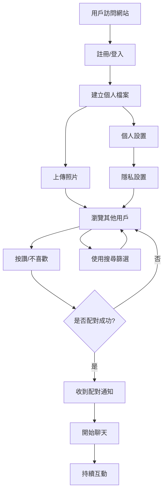

# MKing Friend MVP 功能優先級矩陣

## 概述

本文檔基於用戶價值、技術複雜度、開發成本和市場需求，對 MKing Friend 的功能進行優先級分析，明確 MVP (Minimum Viable Product) 的功能範圍。

## 優先級矩陣

### 評估維度
- **用戶價值** (1-5): 功能對用戶的重要程度
- **技術複雜度** (1-5): 實現難度 (1=簡單, 5=複雜)
- **開發成本** (1-5): 所需時間和資源 (1=低, 5=高)
- **市場需求** (1-5): 市場驗證和競爭需要

### MVP 功能分類

#### 🔴 P0 - MVP 核心 (必須有)
用戶價值 ≥ 4, 市場需求 ≥ 4

| 功能 | 用戶價值 | 技術複雜度 | 開發成本 | 市場需求 | MVP 狀態 | 說明 |
|------|----------|------------|----------|----------|----------|------|
| 用戶註冊/登入 | 5 | 2 | 2 | 5 | ✅ 必須 | 基礎功能，無此無法使用 |
| 個人檔案建立 | 5 | 2 | 2 | 5 | ✅ 必須 | 展示自己的基礎 |
| 照片上傳 | 5 | 3 | 3 | 5 | ✅ 必須 | 視覺化交友的核心 |
| 用戶瀏覽 | 5 | 3 | 3 | 5 | ✅ 必須 | 發現其他用戶 |
| 按讚/不喜歡 | 5 | 2 | 2 | 5 | ✅ 必須 | 核心互動機制 |
| 配對通知 | 5 | 3 | 3 | 5 | ✅ 必須 | 成功配對的反饋 |
| 基礎聊天 | 5 | 4 | 4 | 5 | ✅ 必須 | 配對後的溝通 |
| 響應式設計 | 4 | 3 | 3 | 4 | ✅ 必須 | 多設備支援 |

#### 🟡 P1 - MVP 增強 (強烈建議)
用戶價值 ≥ 3, 技術複雜度 ≤ 4

| 功能 | 用戶價值 | 技術複雜度 | 開發成本 | 市場需求 | MVP 狀態 | 說明 |
|------|----------|------------|----------|----------|----------|------|
| 基礎搜尋篩選 | 4 | 3 | 3 | 4 | 🟡 建議 | 提升配對精準度 |
| 個人設置 | 4 | 2 | 2 | 3 | 🟡 建議 | 個性化體驗 |
| 隱私設置 | 4 | 3 | 3 | 4 | 🟡 建議 | 用戶安全感 |
| 基礎推薦 | 3 | 4 | 4 | 4 | 🟡 建議 | 提升用戶體驗 |
| 訊息狀態 | 3 | 2 | 2 | 3 | 🟡 建議 | 已讀/未讀顯示 |
| 用戶舉報 | 4 | 2 | 2 | 4 | 🟡 建議 | 社群安全 |
| 基礎分析 | 2 | 3 | 3 | 3 | 🟡 建議 | 運營數據 |

#### 🟢 P2 - 增強功能 (可延後)
用戶價值 2-4, 技術複雜度或開發成本較高

| 功能 | 用戶價值 | 技術複雜度 | 開發成本 | 市場需求 | MVP 狀態 | 說明 |
|------|----------|------------|----------|----------|----------|------|
| 多張照片上傳 | 4 | 3 | 3 | 3 | 🟢 延後 | 增強個人展示 |
| 地理位置搜尋 | 4 | 4 | 4 | 3 | 🟢 延後 | 本地化配對 |
| 進階篩選 | 3 | 4 | 4 | 3 | 🟢 延後 | 精準搜尋 |
| 聊天室功能 | 3 | 4 | 4 | 2 | 🟢 延後 | 群組聊天 |
| 圖片分享 | 3 | 3 | 3 | 3 | 🟢 延後 | 聊天增強 |
| 後台管理 | 2 | 4 | 5 | 4 | 🟢 延後 | 運營工具 |
| 多語言支援 | 2 | 3 | 4 | 2 | 🟢 延後 | 國際化 |

#### 🔵 P3 - 高級功能 (未來版本)
技術複雜度 ≥ 4 或市場需求 ≤ 2

| 功能 | 用戶價值 | 技術複雜度 | 開發成本 | 市場需求 | MVP 狀態 | 說明 |
|------|----------|------------|----------|----------|----------|------|
| 語音訊息 | 4 | 4 | 4 | 2 | 🔵 未來 | 豐富溝通方式 |
| 視頻通話 | 4 | 5 | 5 | 2 | 🔵 未來 | 深度互動 |
| AI 推薦 | 3 | 5 | 5 | 2 | 🔵 未來 | 智能配對 |
| 社交遊戲 | 2 | 4 | 4 | 1 | 🔵 未來 | 娛樂功能 |
| 付費功能 | 2 | 3 | 4 | 3 | 🔵 未來 | 商業模式 |
| 第三方整合 | 2 | 4 | 4 | 1 | 🔵 未來 | 生態整合 |
| 移動應用 | 4 | 4 | 5 | 3 | 🔵 未來 | 平台擴展 |

## MVP 功能流程圖

## 用戶故事優先級

### 🔴 P0 用戶故事 (MVP 核心)

1. **作為新用戶，我想要註冊帳號，以便開始使用交友服務**
   - 接受標準: 可以用 email 或第三方帳號註冊
   - 估算: 3 天

2. **作為用戶，我想要建立個人檔案，以便展示自己**
   - 接受標準: 可以填寫基本資訊和上傳照片
   - 估算: 5 天

3. **作為用戶，我想要瀏覽其他用戶，以便找到感興趣的人**
   - 接受標準: 可以看到其他用戶的照片和基本資訊
   - 估算: 5 天

4. **作為用戶，我想要表達喜歡或不喜歡，以便進行配對**
   - 接受標準: 可以滑動或點擊按鈕表達意向
   - 估算: 3 天

5. **作為用戶，我想要在配對成功時收到通知，以便知道有人也喜歡我**
   - 接受標準: 雙方都按讚時顯示配對成功
   - 估算: 3 天

6. **作為配對用戶，我想要聊天，以便進一步了解對方**
   - 接受標準: 可以發送和接收文字訊息
   - 估算: 8 天

### 🟡 P1 用戶故事 (MVP 增強)

1. **作為用戶，我想要篩選搜尋結果，以便找到更合適的人**
   - 接受標準: 可以按年齡、距離等條件篩選
   - 估算: 5 天

2. **作為用戶，我想要設置隱私選項，以便控制誰能看到我**
   - 接受標準: 可以設置可見性和搜尋範圍
   - 估算: 3 天

3. **作為用戶，我想要舉報不當行為，以便維護社群安全**
   - 接受標準: 可以舉報用戶和內容
   - 估算: 3 天

## MVP 成功指標

### 技術指標
- ✅ 用戶註冊流程完成率 > 80%
- ✅ 頁面載入時間 < 3 秒
- ✅ 系統可用性 > 99%
- ✅ 移動端適配完成度 > 95%

### 產品指標
- ✅ 用戶完成檔案建立率 > 70%
- ✅ 日活躍用戶留存率 > 20%
- ✅ 配對成功率 > 5%
- ✅ 聊天開始率 > 50% (配對後)

### 用戶體驗指標
- ✅ 用戶滿意度 > 3.5/5
- ✅ 功能易用性評分 > 4/5
- ✅ 客服問題解決率 > 90%

## 發布策略

### Alpha 版本 (內部測試)
- **功能範圍**: P0 核心功能
- **測試對象**: 開發團隊和內部員工
- **時程**: 8 週後
- **目標**: 驗證核心流程可行性

### Beta 版本 (封閉測試)
- **功能範圍**: P0 + 部分 P1 功能
- **測試對象**: 50-100 名邀請用戶
- **時程**: 10 週後
- **目標**: 收集真實用戶反饋

### MVP 正式版本
- **功能範圍**: P0 + 關鍵 P1 功能
- **發布對象**: 公開用戶
- **時程**: 12 週後
- **目標**: 市場驗證和用戶獲取

## 功能取捨決策

### 保留的功能 (關鍵差異化)
1. **卡片式瀏覽**: 直觀的用戶發現方式
2. **即時配對通知**: 增強用戶參與感
3. **響應式設計**: 確保多設備體驗

### 簡化的功能 (降低複雜度)
1. **基礎聊天**: 先實現文字聊天，後續加入多媒體
2. **簡單推薦**: 基於基本條件，不使用複雜演算法
3. **基礎搜尋**: 提供必要篩選，避免過度複雜

### 延後的功能 (控制範圍)
1. **高級推薦**: 需要大量數據和複雜演算法
2. **語音視頻**: 技術複雜度高，非核心需求
3. **社交功能**: 超出核心交友範圍

## 風險評估

### 高風險功能
- **即時聊天**: 技術複雜，但用戶期望高
- **配對演算法**: 影響用戶體驗，需要持續優化
- **照片上傳**: 涉及存儲和處理成本

### 緩解策略
- **分階段實現**: 先基礎功能，後優化
- **用戶反饋驅動**: 基於實際使用數據調整
- **技術債務管理**: 預留重構時間

---

**文檔版本**: v1.0  
**最後更新**: 2025-01-03  
**審核狀態**: 待產品團隊確認  
**相關文檔**: development-tasks.md, roadmap.md