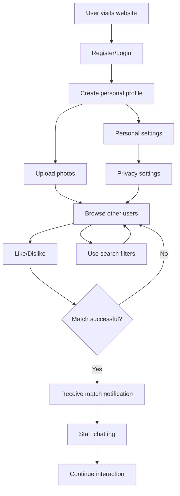

# MKing Friend MVP Feature Priority Matrix

## Overview

This document analyzes the priority of MKing Friend features based on user value, technical complexity, development cost, and market demand, clearly defining the functional scope of the MVP (Minimum Viable Product).

## Priority Matrix

### Evaluation Dimensions
- **User Value** (1-5): Importance of the feature to users
- **Technical Complexity** (1-5): Implementation difficulty (1=simple, 5=complex)
- **Development Cost** (1-5): Required time and resources (1=low, 5=high)
- **Market Demand** (1-5): Market validation and competitive needs

### MVP Feature Classification

#### 🔴 P0 - MVP Core (Must Have)
User Value ≥ 4, Market Demand ≥ 4

| Feature | User Value | Technical Complexity | Development Cost | Market Demand | MVP Status | Description |
|---------|------------|---------------------|------------------|---------------|------------|-------------|
| User Registration/Login | 5 | 2 | 2 | 5 | ✅ Must | Basic functionality, unusable without it |
| Personal Profile Creation | 5 | 2 | 2 | 5 | ✅ Must | Foundation for self-presentation |
| Photo Upload | 5 | 3 | 3 | 5 | ✅ Must | Core of visual dating |
| User Browsing | 5 | 3 | 3 | 5 | ✅ Must | Discover other users |
| Like/Dislike | 5 | 2 | 2 | 5 | ✅ Must | Core interaction mechanism |
| Match Notifications | 5 | 3 | 3 | 5 | ✅ Must | Feedback for successful matches |
| Basic Chat | 5 | 4 | 4 | 5 | ✅ Must | Communication after matching |
| Responsive Design | 4 | 3 | 3 | 4 | ✅ Must | Multi-device support |

#### 🟡 P1 - MVP Enhancement (Strongly Recommended)
User Value ≥ 3, Technical Complexity ≤ 4

| Feature | User Value | Technical Complexity | Development Cost | Market Demand | MVP Status | Description |
|---------|------------|---------------------|------------------|---------------|------------|-------------|
| Basic Search Filters | 4 | 3 | 3 | 4 | 🟡 Recommended | Improve matching accuracy |
| Personal Settings | 4 | 2 | 2 | 3 | 🟡 Recommended | Personalized experience |
| Privacy Settings | 4 | 3 | 3 | 4 | 🟡 Recommended | User security |
| Basic Recommendations | 3 | 4 | 4 | 4 | 🟡 Recommended | Enhance user experience |
| Message Status | 3 | 2 | 2 | 3 | 🟡 Recommended | Read/unread display |
| User Reporting | 4 | 2 | 2 | 4 | 🟡 Recommended | Community safety |
| Basic Analytics | 2 | 3 | 3 | 3 | 🟡 Recommended | Operational data |

#### 🟢 P2 - Enhancement Features (Can Be Delayed)
User Value 2-4, Higher Technical Complexity or Development Cost

| Feature | User Value | Technical Complexity | Development Cost | Market Demand | MVP Status | Description |
|---------|------------|---------------------|------------------|---------------|------------|-------------|
| Multiple Photo Upload | 4 | 3 | 3 | 3 | 🟢 Delayed | Enhanced personal presentation |
| Geolocation Search | 4 | 4 | 4 | 3 | 🟢 Delayed | Localized matching |
| Advanced Filters | 3 | 4 | 4 | 3 | 🟢 Delayed | Precise search |
| Chat Room Features | 3 | 4 | 4 | 2 | 🟢 Delayed | Group chat |
| Image Sharing | 3 | 3 | 3 | 3 | 🟢 Delayed | Chat enhancement |
| Admin Panel | 2 | 4 | 5 | 4 | 🟢 Delayed | Operational tools |
| Multi-language Support | 2 | 3 | 4 | 2 | 🟢 Delayed | Internationalization |

#### 🔵 P3 - Advanced Features (Future Versions)
Technical Complexity ≥ 4 or Market Demand ≤ 2

| Feature | User Value | Technical Complexity | Development Cost | Market Demand | MVP Status | Description |
|---------|------------|---------------------|------------------|---------------|------------|-------------|
| Voice Messages | 4 | 4 | 4 | 2 | 🔵 Future | Rich communication methods |
| Video Calls | 4 | 5 | 5 | 2 | 🔵 Future | Deep interaction |
| AI Recommendations | 3 | 5 | 5 | 2 | 🔵 Future | Intelligent matching |
| Social Games | 2 | 4 | 4 | 1 | 🔵 Future | Entertainment features |
| Premium Features | 2 | 3 | 4 | 3 | 🔵 Future | Business model |
| Third-party Integration | 2 | 4 | 4 | 1 | 🔵 Future | Ecosystem integration |
| Mobile App | 4 | 4 | 5 | 3 | 🔵 Future | Platform expansion |

## MVP Feature Flow Chart

## User Story Priority

### 🔴 P0 User Stories (MVP Core)

1. **As a new user, I want to register an account so I can start using the dating service**
   - Acceptance criteria: Can register with email or third-party accounts
   - Estimate: 3 days

2. **As a user, I want to create a personal profile so I can present myself**
   - Acceptance criteria: Can fill in basic information and upload photos
   - Estimate: 5 days

3. **As a user, I want to browse other users so I can find people I'm interested in**
   - Acceptance criteria: Can see other users' photos and basic information
   - Estimate: 5 days

4. **As a user, I want to express like or dislike so I can match**
   - Acceptance criteria: Can swipe or click buttons to express intentions
   - Estimate: 3 days

5. **As a user, I want to receive notifications when matching is successful so I know someone likes me too**
   - Acceptance criteria: Show match success when both parties like each other
   - Estimate: 3 days

6. **As a matched user, I want to chat so I can get to know the other person better**
   - Acceptance criteria: Can send and receive text messages
   - Estimate: 8 days

### 🟡 P1 User Stories (MVP Enhancement)

1. **As a user, I want to filter search results so I can find more suitable people**
   - Acceptance criteria: Can filter by age, distance and other conditions
   - Estimate: 5 days

2. **As a user, I want to set privacy options so I can control who can see me**
   - Acceptance criteria: Can set visibility and search scope
   - Estimate: 3 days

3. **As a user, I want to report inappropriate behavior so I can maintain community safety**
   - Acceptance criteria: Can report users and content
   - Estimate: 3 days

## MVP Success Metrics

### Technical Metrics
- ✅ User registration completion rate > 80%
- ✅ Page load time < 3 seconds
- ✅ System availability > 99%
- ✅ Mobile adaptation completion > 95%

### Product Metrics
- ✅ User profile completion rate > 70%
- ✅ Daily active user retention rate > 20%
- ✅ Match success rate > 5%
- ✅ Chat initiation rate > 50% (after matching)

### User Experience Metrics
- ✅ User satisfaction > 3.5/5
- ✅ Feature usability score > 4/5
- ✅ Customer service problem resolution rate > 90%

## Release Strategy

### Alpha Version (Internal Testing)
- **Feature Scope**: P0 core features
- **Test Audience**: Development team and internal staff
- **Timeline**: After 8 weeks
- **Goal**: Validate core process feasibility

### Beta Version (Closed Testing)
- **Feature Scope**: P0 + some P1 features
- **Test Audience**: 50-100 invited users
- **Timeline**: After 10 weeks
- **Goal**: Collect real user feedback

### MVP Official Release
- **Feature Scope**: P0 + key P1 features
- **Release Audience**: Public users
- **Timeline**: After 12 weeks
- **Goal**: Market validation and user acquisition

## Feature Trade-off Decisions

### Retained Features (Key Differentiation)
1. **Card-style Browsing**: Intuitive user discovery method
2. **Real-time Match Notifications**: Enhance user engagement
3. **Responsive Design**: Ensure multi-device experience

### Simplified Features (Reduce Complexity)
1. **Basic Chat**: Implement text chat first, add multimedia later
2. **Simple Recommendations**: Based on basic conditions, avoid complex algorithms
3. **Basic Search**: Provide necessary filtering, avoid over-complexity

### Delayed Features (Control Scope)
1. **Advanced Recommendations**: Require large amounts of data and complex algorithms
2. **Voice/Video**: High technical complexity, not core requirement
3. **Social Features**: Beyond core dating scope

## Risk Assessment

### High-Risk Features
- **Real-time Chat**: Technically complex but high user expectations
- **Matching Algorithm**: Affects user experience, requires continuous optimization
- **Photo Upload**: Involves storage and processing costs

### Mitigation Strategies
- **Phased Implementation**: Basic features first, then optimization
- **User Feedback Driven**: Adjust based on actual usage data
- **Technical Debt Management**: Reserve time for refactoring

---

**Document Version**: v1.0  
**Last Updated**: 2025-01-03  
**Review Status**: Pending product team confirmation  
**Related Documents**: development-tasks.md, roadmap.md