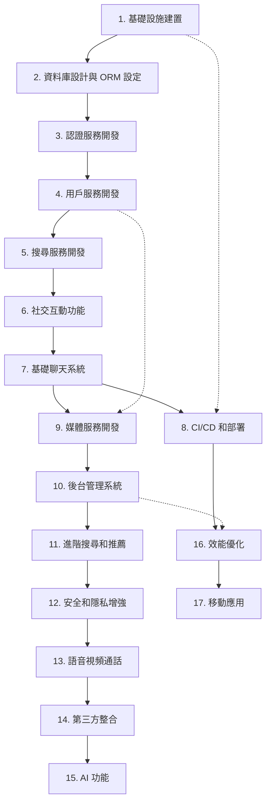

# MKing Friend 任務依賴關係圖

## 概述

本文檔展示了 MKing Friend 專案中各個開發任務之間的依賴關係，幫助開發團隊理解任務執行順序和關鍵路徑。

## 依賴關係圖



## 關鍵路徑分析

### 主要關鍵路徑 (Critical Path)
```
基礎設施建置 → 資料庫設計 → 認證服務 → 用戶服務 → 搜尋服務 → 社交互動 → 基礎聊天系統
```

**總時程**: 10 週 (MVP 完成)

### 次要關鍵路徑
```
基礎聊天系統 → 媒體服務 → 後台管理 → 進階搜尋 → 安全增強 → 語音視頻 → 第三方整合 → AI 功能
```

**總時程**: 額外 18 週 (完整功能)

## 並行開發機會

### Phase 1 並行任務
- **CI/CD 設置** 可以在基礎功能開發完成後立即開始
- **前端 UI 組件** 可以在 API 設計確定後並行開發
- **測試框架** 可以在各服務開發過程中並行建立

### Phase 2 並行任務
- **媒體服務** 可以在聊天系統基礎完成後立即開始
- **效能優化** 可以在各功能模組完成後持續進行
- **安全審計** 可以在功能開發過程中並行進行

## 依賴關係詳細說明

### 強依賴 (Hard Dependencies)

| 任務 | 依賴任務 | 依賴原因 |
|------|----------|----------|
| 資料庫設計 | 基礎設施建置 | 需要 PostgreSQL 環境 |
| 認證服務 | 資料庫設計 | 需要 User 資料模型 |
| 用戶服務 | 認證服務 | 需要身份驗證機制 |
| 搜尋服務 | 用戶服務 | 需要用戶資料進行搜尋 |
| 社交互動 | 搜尋服務 | 需要用戶發現功能 |
| 基礎聊天 | 社交互動 | 需要配對關係 |
| 媒體服務 | 基礎聊天 | 擴展聊天功能 |
| 後台管理 | 媒體服務 | 需要管理所有內容類型 |

### 軟依賴 (Soft Dependencies)

| 任務 | 建議依賴 | 依賴原因 |
|------|----------|----------|
| CI/CD | 基礎功能 | 有代碼才需要部署 |
| 效能優化 | 功能完成 | 需要實際負載進行優化 |
| 移動應用 | Web 版穩定 | 複用 API 和業務邏輯 |
| AI 功能 | 數據積累 | 需要用戶行為數據 |

## 風險依賴分析

### 高風險依賴
1. **基礎設施 → 所有後續任務**
   - 風險: 基礎設施問題影響全局
   - 緩解: 提前驗證架構可行性

2. **認證服務 → 所有業務功能**
   - 風險: 認證問題影響所有功能
   - 緩解: 優先完成並充分測試

3. **資料庫設計 → 所有數據相關功能**
   - 風險: Schema 變更成本高
   - 緩解: 詳細設計評審

### 中風險依賴
1. **搜尋服務 → 用戶體驗**
   - 風險: 搜尋效果影響用戶留存
   - 緩解: 分階段優化搜尋演算法

2. **聊天系統 → 核心價值**
   - 風險: 即時性問題影響用戶體驗
   - 緩解: 充分的負載測試

## 資源分配建議

### 團隊配置
- **後端團隊 (3-4 人)**: 專注微服務開發
- **前端團隊 (2-3 人)**: 專注用戶界面
- **DevOps 工程師 (1 人)**: 專注基礎設施
- **測試工程師 (1 人)**: 專注品質保證

### 時間分配
- **Phase 1 (MVP)**: 60% 資源投入
- **Phase 2 (增強)**: 25% 資源投入
- **Phase 3 (高級)**: 10% 資源投入
- **Phase 4 (優化)**: 5% 資源投入

## 里程碑檢查點

### 週檢查點
- **第 2 週**: 基礎設施完成度檢查
- **第 4 週**: 認證和用戶服務檢查
- **第 6 週**: 搜尋和社交功能檢查
- **第 8 週**: 聊天系統檢查
- **第 10 週**: MVP 完整性檢查

### 品質門檻
每個里程碑必須滿足:
- 功能完整性 ≥ 95%
- 測試覆蓋率 ≥ 80%
- 效能指標達標
- 安全檢查通過

## 應急計劃

### 關鍵路徑延誤
1. **基礎設施延誤**: 考慮使用雲服務快速部署
2. **認證服務延誤**: 優先實現基本認證，後續增強
3. **聊天系統延誤**: 先實現基本訊息，後續加入即時性

### 資源不足
1. **開發人力不足**: 調整功能範圍，專注核心功能
2. **時間壓力**: 將部分 P2 功能移至後續版本
3. **技術難題**: 尋求外部技術支援或替代方案

---

**文檔版本**: v1.0  
**最後更新**: 2025-01-03  
**相關文檔**: development-tasks.md, roadmap.md