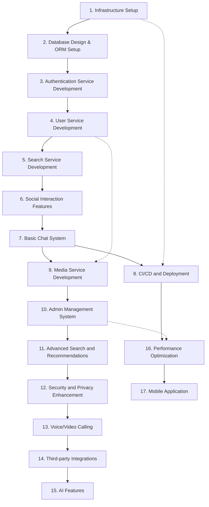

# MKing Friend Task Dependencies Diagram

## Overview

This document illustrates the dependency relationships between various development tasks in the MKing Friend project, helping the development team understand task execution order and critical paths.

## Dependency Diagram



## Critical Path Analysis

### Primary Critical Path
```
Infrastructure Setup → Database Design → Authentication Service → User Service → Search Service → Social Interaction → Basic Chat System
```

**Total Duration**: 10 weeks (MVP completion)

### Secondary Critical Path
```
Basic Chat System → Media Service → Admin Management → Advanced Search → Security Enhancement → Voice/Video → Third-party Integration → AI Features
```

**Total Duration**: Additional 18 weeks (full features)

## Parallel Development Opportunities

### Phase 1 Parallel Tasks
- **CI/CD Setup** can begin immediately after basic functionality is completed
- **Frontend UI Components** can be developed in parallel once API design is finalized
- **Testing Framework** can be established in parallel during service development

### Phase 2 Parallel Tasks
- **Media Service** can begin immediately after chat system foundation is complete
- **Performance Optimization** can proceed continuously after each functional module is completed
- **Security Audit** can be conducted in parallel during feature development

## Detailed Dependency Relationships

### Hard Dependencies

| Task | Dependent Task | Dependency Reason |
|------|----------------|-------------------|
| Database Design | Infrastructure Setup | Requires PostgreSQL environment |
| Authentication Service | Database Design | Requires User data model |
| User Service | Authentication Service | Requires authentication mechanism |
| Search Service | User Service | Requires user data for search |
| Social Interaction | Search Service | Requires user discovery functionality |
| Basic Chat | Social Interaction | Requires matching relationships |
| Media Service | Basic Chat | Extends chat functionality |
| Admin Management | Media Service | Needs to manage all content types |

### Soft Dependencies

| Task | Suggested Dependency | Dependency Reason |
|------|---------------------|-------------------|
| CI/CD | Basic Features | Need code to deploy |
| Performance Optimization | Feature Completion | Requires actual load for optimization |
| Mobile Application | Web Version Stable | Reuses APIs and business logic |
| AI Features | Data Accumulation | Requires user behavior data |

## Risk Dependency Analysis

### High-Risk Dependencies
1. **Infrastructure → All Subsequent Tasks**
   - Risk: Infrastructure issues affect the entire project
   - Mitigation: Validate architecture feasibility early

2. **Authentication Service → All Business Functions**
   - Risk: Authentication issues affect all functionality
   - Mitigation: Prioritize completion and thorough testing

3. **Database Design → All Data-Related Functions**
   - Risk: High cost of schema changes
   - Mitigation: Detailed design review

### Medium-Risk Dependencies
1. **Search Service → User Experience**
   - Risk: Search effectiveness affects user retention
   - Mitigation: Phased optimization of search algorithms

2. **Chat System → Core Value**
   - Risk: Real-time issues affect user experience
   - Mitigation: Comprehensive load testing

## Resource Allocation Recommendations

### Team Configuration
- **Backend Team (3-4 people)**: Focus on microservice development
- **Frontend Team (2-3 people)**: Focus on user interface
- **DevOps Engineer (1 person)**: Focus on infrastructure
- **Test Engineer (1 person)**: Focus on quality assurance

### Time Allocation
- **Phase 1 (MVP)**: 60% resource investment
- **Phase 2 (Enhancement)**: 25% resource investment
- **Phase 3 (Advanced)**: 10% resource investment
- **Phase 4 (Optimization)**: 5% resource investment

## Milestone Checkpoints

### Weekly Checkpoints
- **Week 2**: Infrastructure completion check
- **Week 4**: Authentication and user service check
- **Week 6**: Search and social features check
- **Week 8**: Chat system check
- **Week 10**: MVP completeness check

### Quality Gates
Each milestone must satisfy:
- Feature completeness ≥ 95%
- Test coverage ≥ 80%
- Performance metrics met
- Security checks passed

## Contingency Plans

### Critical Path Delays
1. **Infrastructure Delays**: Consider using cloud services for rapid deployment
2. **Authentication Service Delays**: Prioritize basic authentication, enhance later
3. **Chat System Delays**: Implement basic messaging first, add real-time features later

### Resource Shortages
1. **Development Manpower Shortage**: Adjust feature scope, focus on core functionality
2. **Time Pressure**: Move some P2 features to subsequent versions
3. **Technical Challenges**: Seek external technical support or alternative solutions

---

**Document Version**: v1.0  
**Last Updated**: 2025-01-03  
**Related Documents**: development-tasks.md, roadmap.md